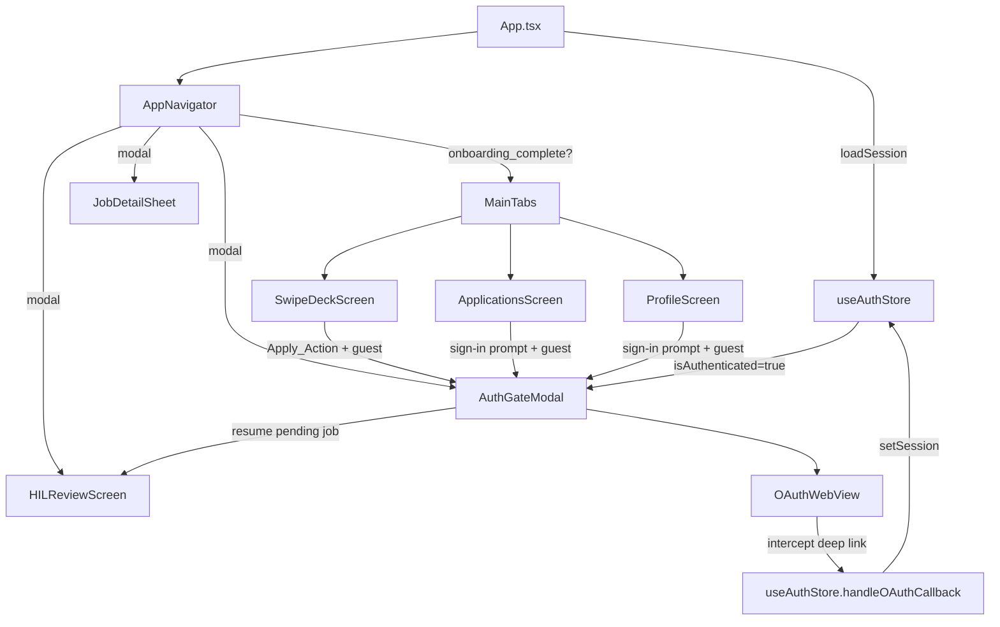

# Design Document: Guest Mode Auth

## Overview

This feature removes the sign-in gate at app launch and defers authentication to the moment a user performs an Apply_Action. It also replaces the current system-browser OAuth flow with an in-app WebView so no Supabase URL is ever visible.

### Current State

- `AppNavigator` routes directly to `Main` (tabs) after onboarding, but `useAuthStore.loadSession` is called on mount — if no session exists the user still lands on the swipe deck. However, `SwipeDeckScreen.handleSwipeRight` already has a guard that navigates to `Auth` when `!isAuthenticated`. The `AuthScreen` calls `signInWithGoogle()` which calls `Linking.openURL(data.url)`, opening the system browser and exposing the raw Supabase OAuth URL.
- There is no guest-mode concept in the Zustand store — `isAuthenticated: false` is the implicit guest state, but it is not explicitly modelled.

### Target State

1. `isAuthenticated: false` is the explicit, first-class guest state — no code path forces sign-in before the swipe deck.
2. Apply_Actions (swipe right, tap ✓) trigger an `AuthGateModal` (a new modal screen) that contains the `OAuthWebView` component.
3. The `OAuthWebView` intercepts the `jobswipeapp://auth/callback` deep link inside the WebView before it leaves the app, extracts tokens, and completes the session — the Supabase URL is never shown.
4. `ProfileScreen` and `ApplicationsScreen` show a contextual sign-in prompt for guest users.

---

## Architecture



### Key Design Decisions

**Decision 1 — Keep `isAuthenticated: false` as guest state, add `isGuest` selector.**
Rather than adding a new `isGuest` boolean field, a derived selector `isGuest = !isAuthenticated` keeps the store minimal. This avoids a third state that could get out of sync.

**Decision 2 — `AuthGateModal` as a Stack screen with `presentation: 'modal'`.**
Reuses the existing React Navigation modal pattern already used by `Auth`, `HILReview`, and `JobDetail`. The pending job is passed as a route param, matching the existing `Auth` screen contract.

**Decision 3 — `OAuthWebView` intercepts the redirect inside the WebView via `onShouldStartLoadWithRequest`.**
This is the standard React Native WebView approach for in-app OAuth. The WebView never actually navigates to `jobswipeapp://auth/callback` — the callback is intercepted synchronously, preventing any "URL not found" error and keeping the flow entirely in-app.

**Decision 4 — Remove `Linking.openURL` from `signInWithGoogle`; replace with a callback-based API.**
`signInWithGoogle` will return the OAuth URL instead of opening it. The `OAuthWebView` component owns the URL and the interception logic. This keeps the store free of UI concerns.

**Decision 5 — Android only.**
No `Platform.OS === 'ios'` guards needed — the feature is Android-only per scope. No iOS-specific WebView configuration is added.

---

## Components and Interfaces

### 1. `useAuthStore` changes

```typescript
interface AuthStore {
  session: AuthSession | null;
  isAuthenticated: boolean;
  // NEW
  getOAuthUrl: () => Promise<string>;          // returns OAuth URL without opening browser
  handleOAuthCallback: (url: string) => Promise<void>; // parses callback URL, sets session
  // UNCHANGED
  signOut: () => Promise<void>;
  refreshSession: () => Promise<void>;
  loadSession: () => Promise<void>;
}
```

`signInWithGoogle` is removed. `getOAuthUrl` replaces it — it calls `supabase.auth.signInWithOAuth` with `skipBrowserRedirect: true` and returns `data.url`. The `Linking.openURL` call is deleted entirely.

`handleOAuthCallback(url)` replaces the module-level `handleDeepLink` function. It parses the fragment/query params from the callback URL, calls `supabase.auth.setSession`, persists to AsyncStorage, and updates store state. It is now a store action so it can be called from the WebView component cleanly.

The module-level `Linking.addEventListener` and `Linking.getInitialURL` listeners are **removed** — they are no longer needed because the WebView intercepts the redirect before it ever reaches the OS deep link system.

### 2. `OAuthWebView` component

**Path:** `src/components/OAuthWebView.tsx`

```typescript
interface OAuthWebViewProps {
  onSuccess: () => void;
  onCancel: () => void;
  onError: (message: string) => void;
}
```

Responsibilities:
- Calls `useAuthStore(s => s.getOAuthUrl)` on mount to get the OAuth URL.
- Renders a `react-native-webview` `WebView` pointed at the OAuth URL.
- Implements `onShouldStartLoadWithRequest`: if the URL starts with `jobswipeapp://auth/callback`, calls `handleOAuthCallback(url)` and returns `false` (blocks navigation). On success calls `onSuccess()`.
- Implements a 15-second load timeout via `useRef` + `setTimeout`. If the page hasn't loaded (`onLoadEnd` not fired), calls `onError('Connection timed out')`.
- Implements `onNavigationStateChange`: if the user navigates to a URL that is not `accounts.google.com`, `oauth2.googleapis.com`, or the Supabase auth domain, calls `onCancel()`.
- Shows an `ActivityIndicator` while loading (`onLoadStart` / `onLoadEnd`).

### 3. `AuthGateModal` screen

**Path:** `src/screens/AuthGateModal.tsx`

Replaces `AuthScreen`. Route params:

```typescript
type AuthGateParams = {
  pendingJob?: JobCard;
  returnTo?: 'Applications' | 'Profile'; // for sign-in from tabs
};
```

States:
- `idle` — shows "Sign in to Apply" copy + "Continue with Google" button.
- `loading` — shows `OAuthWebView`.
- `error` — shows error message + retry button.

On `OAuthWebView.onSuccess`:
- If `pendingJob` is set → `navigation.replace('HILReview', { job: pendingJob, autoApply: false })`.
- If `returnTo` is set → `navigation.goBack()` (the originating tab re-renders with auth state).
- Otherwise → `navigation.goBack()`.

On `OAuthWebView.onCancel` → dismiss WebView, return to `idle` state.
On `OAuthWebView.onError(msg)` → dismiss WebView, show error state with retry.

### 4. `AppNavigator` changes

- Replace `Auth` stack screen with `AuthGateModal` screen.
- Update `RootStackParamList`:

```typescript
export type RootStackParamList = {
  Onboarding: undefined;
  Main: undefined;
  JobDetail: { job: JobCard };
  HILReview: { job: JobCard; autoApply: boolean };
  AuthGate: { pendingJob?: JobCard; returnTo?: 'Applications' | 'Profile' };
};
```

### 5. `SwipeDeckScreen` changes

- Replace `navigation.navigate('Auth', { pendingJob: job })` with `navigation.navigate('AuthGate', { pendingJob: job })` in `handleSwipeRight`.
- No other changes needed — the existing `!isAuthenticated` guard is correct.

### 6. `ProfileScreen` changes

- When `!isAuthenticated`: replace the "Not signed in" row with a `TouchableOpacity` that calls `navigation.navigate('AuthGate', { returnTo: 'Profile' })`.
- The `navigation` prop must be added to `ProfileScreen` (currently it does not receive it).

### 7. `ApplicationsScreen` changes

- When `drafts.length === 0` and `!isAuthenticated`: replace the empty state with a guest-specific empty state that includes a "Sign in to see your applications" prompt and a button that calls `navigation.navigate('AuthGate', { returnTo: 'Applications' })`.
- The `navigation` prop must be added to `ApplicationsScreen`.

---

## Data Models

No new persistent data models are introduced. The existing `AuthSession` type in `src/types.ts` is unchanged.

### `AuthSession` (existing, unchanged)

```typescript
export interface AuthSession {
  access_token: string;
  refresh_token: string;
  user_id: string;
  email: string;
  avatar_url?: string;
  expires_at: number; // Unix timestamp (seconds)
}
```

### Session validity rule

A session is valid if and only if `session.expires_at > Date.now() / 1000`. This check already exists in `loadSession` and is unchanged.

### AsyncStorage keys (existing, unchanged)

| Key | Value |
|-----|-------|
| `KEYS.AUTH_SESSION` | `AuthSession \| null` |

### Navigation param additions

`RootStackParamList.AuthGate` is a new entry — see Components section above.

---
