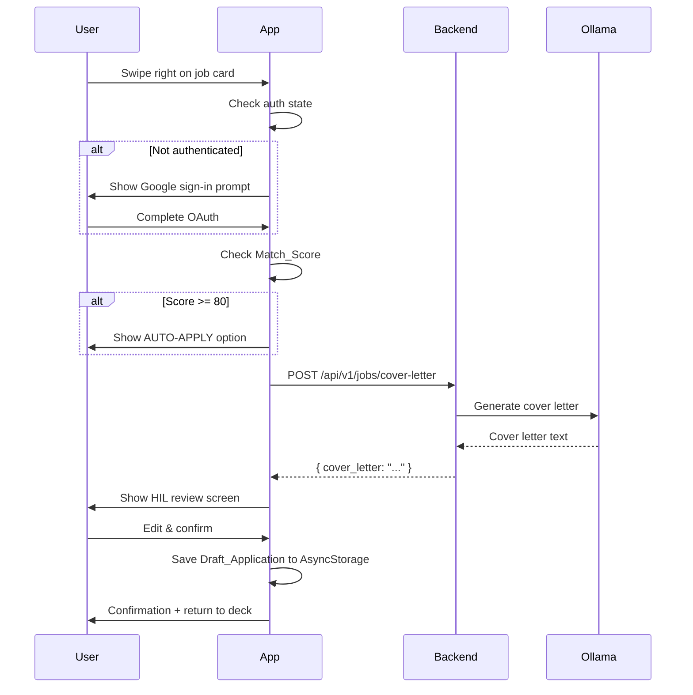
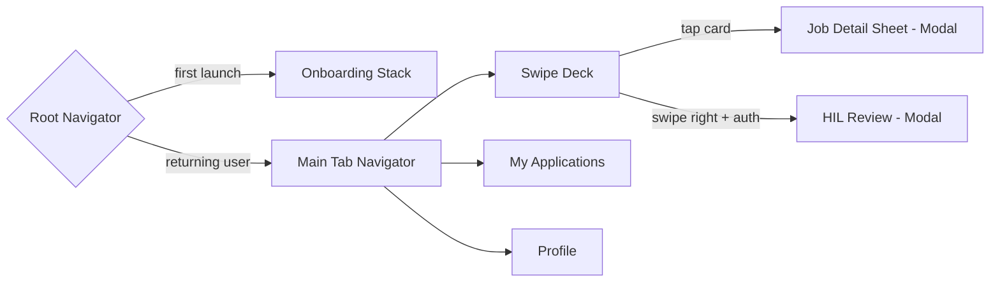

# Design Document: Job Swipe App

## Overview

The Job Swipe App is a React Native mobile application (iOS + Android) that presents job listings in a Tinder-style swipe deck. Users swipe right to apply (triggering an AI-assisted cover letter flow) or left to skip. All AI operations — resume parsing, match scoring, cover letter generation — are proxied through the existing Railway FastAPI backend using Ollama `llama3.2:1b`. Authentication is handled via Supabase Google OAuth, shared with the existing backend.

The app is designed to work without authentication for browsing and resume upload, gating only application actions behind sign-in. Offline resilience is achieved through AsyncStorage caching of job cards and draft applications.

### Key Design Decisions

- **No new auth system**: Reuse Supabase Google OAuth already wired into the backend. The mobile app exchanges the Google OAuth token for a Supabase session JWT.
- **Ollama only**: All LLM calls go through `/api/v1/ollama/chat`. No Groq or paid LLM is used in the mobile flow.
- **react-native-deck-swiper**: Chosen over raw gesture-handler for the swipe deck — it provides card stacking, overlay labels, and swipe callbacks out of the box, reducing custom animation code.
- **AsyncStorage for local persistence**: Draft applications, swipe history, cached job cards, and resume summary are all stored in AsyncStorage. No SQLite needed given the data volume.
- **Backend-side match scoring**: Match scores are computed server-side using pgvector cosine similarity, not on-device, to keep the mobile bundle lean.

---

## Architecture

```mermaid
graph TD
    subgraph Mobile App (React Native)
        UI[Swipe Deck / Screens]
        NAV[React Navigation]
        STATE[Zustand Store]
        STORAGE[AsyncStorage]
        UI --> NAV
        UI --> STATE
        STATE --> STORAGE
    end

    subgraph Railway Backend (FastAPI)
        FEED[GET /api/v1/jobs/feed]
        COVER[POST /api/v1/jobs/cover-letter]
        PARSE[POST /api/v1/resume/parse]
        PROFILE[POST /api/v1/profile/sync]
        OLLAMA_PROXY[POST /api/v1/ollama/chat]
        PG[(PostgreSQL + pgvector)]
        OLLAMA[Ollama llama3.2:1b]

        FEED --> PG
        COVER --> OLLAMA_PROXY
        PARSE --> OLLAMA_PROXY
        OLLAMA_PROXY --> OLLAMA
    end

    subgraph Supabase
        AUTH[Google OAuth / JWT]
    end

    UI -->|HTTP/JSON| FEED
    UI -->|HTTP/JSON| COVER
    UI -->|multipart| PARSE
    UI -->|HTTP/JSON| PROFILE
    UI -->|OAuth| AUTH
    AUTH -->|JWT| UI
```

### Data Flow: Swipe Right → Apply



---

## Components and Interfaces

### React Native Project Structure

```
job-swipe-app/
├── src/
│   ├── screens/
│   │   ├── OnboardingScreen.tsx       # Welcome + resume upload + preferences
│   │   ├── SwipeDeckScreen.tsx        # Main swipe UI
│   │   ├── JobDetailSheet.tsx         # Bottom sheet for full job description
│   │   ├── HILReviewScreen.tsx        # Cover letter edit + confirm
│   │   ├── ApplicationsScreen.tsx     # Draft applications list
│   │   ├── ProfileScreen.tsx          # Resume, settings, sign-out
│   │   └── AuthScreen.tsx             # Google sign-in
│   ├── components/
│   │   ├── JobCard.tsx                # Single swipeable card
│   │   ├── MatchScoreBadge.tsx        # Colour-coded score badge
│   │   ├── OfflineBanner.tsx          # Offline mode indicator
│   │   └── LoadingOverlay.tsx         # Full-screen loading state
│   ├── store/
│   │   ├── useJobStore.ts             # Job feed, swipe history, deck state
│   │   ├── useAuthStore.ts            # Auth session, user profile
│   │   └── useApplicationStore.ts     # Draft applications
│   ├── api/
│   │   ├── jobsApi.ts                 # /jobs/feed, /jobs/cover-letter
│   │   ├── resumeApi.ts               # /resume/parse
│   │   └── profileApi.ts             # /profile/sync
│   ├── utils/
│   │   ├── storage.ts                 # AsyncStorage helpers
│   │   └── network.ts                 # NetInfo + retry logic
│   └── navigation/
│       └── AppNavigator.tsx           # Stack + Tab navigator setup
```

### Navigation Structure



### Key Component Interfaces

```typescript
// JobCard props
interface JobCardProps {
  job: JobCard;
  onSwipeRight: (job: JobCard) => void;
  onSwipeLeft: (job: JobCard) => void;
  onTap: (job: JobCard) => void;
}

// Swipe deck configuration (react-native-deck-swiper)
interface DeckConfig {
  cards: JobCard[];
  onSwipedRight: (index: number) => void;
  onSwipedLeft: (index: number) => void;
  overlayLabels: {
    right: { title: 'APPLY'; style: OverlayStyle };
    left:  { title: 'SKIP';  style: OverlayStyle };
  };
  animationDuration: 300; // ms — satisfies Req 3.4
  cardIndex: number;
  backgroundColor: 'transparent';
}
```

### Backend API Interfaces (New Endpoints)

#### `GET /api/v1/jobs/feed`

```
Query params:
  resume_summary: string   (required — used for vector search)
  exclude_ids:    string   (optional — comma-separated job IDs)
  limit:          int      (optional, default 20)

Response 200:
{
  "jobs": [
    {
      "id":           string,
      "title":        string,
      "company":      string,
      "location":     string,
      "source":       "linkedin" | "naukri",
      "description":  string,       // full text
      "excerpt":      string,       // ≤ 300 chars
      "match_score":  number,       // 0–100
      "apply_url":    string
    }
  ],
  "total": number
}
```

#### `POST /api/v1/jobs/cover-letter`

```
Request body:
{
  "job_id":         string,
  "job_title":      string,
  "company":        string,
  "job_description": string,
  "resume_summary": string
}

Response 200:
{ "cover_letter": string }

Response 503:
{ "detail": "Ollama service unavailable." }
```

#### `POST /api/v1/resume/parse`

```
Request: multipart/form-data
  file: File   (PDF or .txt, ≤ 5 MB)

Response 200:
{
  "name":             string,
  "email":            string,
  "phone":            string,
  "skills":           string[],
  "experience_summary": string,
  "target_roles":     string[]
}

Response 400:
{ "detail": "Unsupported file type. Use PDF or .txt." }

Response 413:
{ "detail": "File exceeds 5 MB limit." }
```

---

## Data Models

### Local Storage Schema (AsyncStorage)

All keys are prefixed with `@jsa:` (job swipe app).

```typescript
// Stored at @jsa:resume_summary
interface ResumeSummary {
  name: string;
  email: string;
  phone: string;
  skills: string[];
  experience_summary: string;
  target_roles: string[];
  raw_text?: string;           // for re-parsing
  synced_at: string;           // ISO timestamp
}

// Stored at @jsa:swipe_history  (array)
interface SwipeRecord {
  job_id: string;
  direction: 'right' | 'left';
  timestamp: string;           // ISO
  status?: 'interested' | 'skipped' | 'applied' | 'auto-applied';
}

// Stored at @jsa:cached_jobs  (array)
interface CachedJobBatch {
  fetched_at: string;
  jobs: JobCard[];
}

// Stored at @jsa:draft_applications  (array)
interface DraftApplication {
  id: string;                  // uuid
  job_id: string;
  job_title: string;
  company: string;
  apply_url: string;
  cover_letter: string;
  status: 'draft' | 'auto-applied';
  created_at: string;
  updated_at: string;
}

// Stored at @jsa:auth_session
interface AuthSession {
  access_token: string;
  refresh_token: string;
  user_id: string;
  email: string;
  avatar_url?: string;
  expires_at: number;          // unix timestamp
}

// Stored at @jsa:preferences
interface UserPreferences {
  target_roles: string[];
  preferred_locations: string[];
  auto_apply_threshold: number;  // default 80, range 70–95 step 5
  onboarding_complete: boolean;
}
```

### Zustand Store Shape

```typescript
// useJobStore
interface JobStore {
  deck: JobCard[];
  swipeHistory: SwipeRecord[];
  isLoading: boolean;
  error: string | null;
  fetchFeed: () => Promise<void>;
  swipeRight: (job: JobCard) => void;
  swipeLeft: (job: JobCard) => void;
  resetHistory: () => void;
}

// useAuthStore
interface AuthStore {
  session: AuthSession | null;
  isAuthenticated: boolean;
  signInWithGoogle: () => Promise<void>;
  signOut: () => void;
  refreshSession: () => Promise<void>;
}

// useApplicationStore
interface ApplicationStore {
  drafts: DraftApplication[];
  saveDraft: (draft: DraftApplication) => void;
  updateDraft: (id: string, updates: Partial<DraftApplication>) => void;
  deleteDraft: (id: string) => void;
}
```

### Backend Database Schema (New Tables)

```sql
-- Job listings table (populated by existing scrapers)
CREATE TABLE IF NOT EXISTS job_listings (
    id            TEXT PRIMARY KEY,          -- stable hash of url+title
    title         TEXT NOT NULL,
    company       TEXT NOT NULL,
    location      TEXT,
    source        TEXT NOT NULL,             -- 'linkedin' | 'naukri'
    description   TEXT NOT NULL,
    apply_url     TEXT NOT NULL,
    embedding     vector(768),               -- nomic-embed-text
    scraped_at    TIMESTAMP DEFAULT NOW(),
    updated_at    TIMESTAMP DEFAULT NOW()
);

CREATE INDEX IF NOT EXISTS idx_job_listings_embedding
    ON job_listings USING ivfflat (embedding vector_cosine_ops);
```

The `match_score` is computed at query time via cosine similarity between the resume embedding and each job's embedding — it is not stored, keeping the table lean and scores always fresh relative to the current resume.


---

## Correctness Properties

*A property is a characteristic or behavior that should hold true across all valid executions of a system — essentially, a formal statement about what the system should do. Properties serve as the bridge between human-readable specifications and machine-verifiable correctness guarantees.*

**Property Reflection:** Before listing properties, redundancies were eliminated:
- 1.3 (file rejection error) is subsumed by the 1.2 property — the same generator covers invalid inputs.
- 3.7 (swipe record shape) is subsumed by Properties 3 and 4 which verify the full SwipeRecord shape.
- 7.5 (delete from AsyncStorage) is subsumed by Property 8 which verifies persistence after delete.
- 10.1 (history maintained) is subsumed by Properties 3 and 4.
- 14.4 (drafts survive outage) is subsumed by Property 9 (draft persistence).
- 11.5 (onboarding not shown again) and 11.4 (no badge without resume) are kept as they test distinct invariants.
- 13.2 and 13.3 are kept separate — ordering vs. shape are distinct properties.
- 12.5 (sign-out preserves data) and 10.4 (swipe history persists) are merged into one sign-out data preservation property.

---

### Property 1: File validation accepts only valid types and sizes

*For any* file object with a given MIME type and byte size, the resume file validator SHALL accept it if and only if the type is `application/pdf` or `text/plain` AND the size is ≤ 5,242,880 bytes (5 MB).

**Validates: Requirements 1.2, 1.3**

---

### Property 2: Resume parse response always contains required fields

*For any* valid resume text submitted to `POST /api/v1/resume/parse`, the response SHALL always contain all of the following keys: `name`, `email`, `phone`, `skills`, `experience_summary`, `target_roles`.

**Validates: Requirements 1.5**

---

### Property 3: Resume summary storage round-trip

*For any* `ResumeSummary` object, storing it via the storage utility and then reading it back SHALL produce an object equal to the original.

**Validates: Requirements 1.6**

---

### Property 4: Swipe right always records an "interested" entry

*For any* `JobCard`, calling `swipeRight` SHALL result in a `SwipeRecord` with `job_id` matching the card's ID, `direction === 'right'`, `status === 'interested'`, and a valid ISO timestamp being present in the swipe history.

**Validates: Requirements 3.1, 3.7, 10.1**

---

### Property 5: Swipe left always records a "skipped" entry

*For any* `JobCard`, calling `swipeLeft` SHALL result in a `SwipeRecord` with `job_id` matching the card's ID, `direction === 'left'`, `status === 'skipped'`, and a valid ISO timestamp being present in the swipe history.

**Validates: Requirements 3.2, 3.7**

---

### Property 6: Auth session storage round-trip

*For any* `AuthSession` object, storing it via the auth store and then reading it back SHALL produce a session with the same `access_token`, `user_id`, and `expires_at` values.

**Validates: Requirements 4.2**

---

### Property 7: HIL flow is triggered for all scores below 80

*For any* `Match_Score` value in the range [0, 79], when an authenticated user swipes right on a job with that score, the app SHALL initiate the HIL flow (not the AUTO-APPLY flow).

**Validates: Requirements 5.1**

---

### Property 8: AUTO-APPLY option is shown for all scores at or above 80

*For any* `Match_Score` value in the range [80, 100], when an authenticated user swipes right on a job with that score, the app SHALL display the AUTO-APPLY option.

**Validates: Requirements 6.1**

---

### Property 9: Draft application storage round-trip

*For any* array of `DraftApplication` objects, saving them to the application store and reloading the store from AsyncStorage SHALL produce an array containing all original drafts with all fields preserved.

**Validates: Requirements 5.6, 7.6, 14.4**

---

### Property 10: Deleting a draft removes it from the store

*For any* non-empty list of `DraftApplication` objects and any draft `id` in that list, calling `deleteDraft(id)` SHALL result in a store state where no draft with that `id` exists, and all other drafts remain unchanged.

**Validates: Requirements 7.4, 7.5**

---

### Property 11: Job card always renders all required fields

*For any* `JobCard` object with all required fields populated, rendering the `JobCard` component SHALL produce output containing the job title, company name, location, source, match score badge, and description excerpt.

**Validates: Requirements 2.3, 8.1**

---

### Property 12: Match score badge colour mapping is always correct

*For any* integer `Match_Score` in [0, 100], the `MatchScoreBadge` component SHALL render with colour green if score ≥ 80, yellow if 50 ≤ score ≤ 79, and red if score < 50.

**Validates: Requirements 8.2**

---

### Property 13: Deck refetch is triggered when fewer than 3 cards remain

*For any* deck state with card count in [0, 2], the job store SHALL trigger a `fetchFeed` call. For any deck state with card count ≥ 3, no automatic fetch SHALL be triggered.

**Validates: Requirements 2.4**

---

### Property 14: Swipe history IDs are always included in feed requests

*For any* `SwipeRecord` array stored in the swipe history, calling `fetchFeed` SHALL include all `job_id` values from that array in the `exclude_ids` query parameter sent to `GET /api/v1/jobs/feed`.

**Validates: Requirements 2.5, 10.2**

---

### Property 15: Client-side deduplication removes all history-present jobs

*For any* list of `JobCard` objects and any `SwipeRecord` array, the client-side deduplication filter SHALL remove every job whose `id` appears in the swipe history, and retain all jobs whose `id` does not appear in the history.

**Validates: Requirements 10.3**

---

### Property 16: Swipe history persists across store reloads

*For any* array of `SwipeRecord` objects saved to AsyncStorage, reloading the job store SHALL produce a swipe history containing all original records.

**Validates: Requirements 10.4**

---

### Property 17: Sign-out preserves drafts and swipe history

*For any* non-empty `DraftApplication` array and `SwipeRecord` array, calling `signOut` SHALL leave both arrays unchanged in AsyncStorage while clearing the auth session.

**Validates: Requirements 12.5**

---

### Property 18: AUTO-APPLY threshold validation

*For any* integer value, the threshold validator SHALL accept it if and only if it is a multiple of 5 in the inclusive range [70, 95].

**Validates: Requirements 12.6**

---

### Property 19: Job feed response fields are always complete

*For any* call to `GET /api/v1/jobs/feed` with a valid `resume_summary`, every job object in the response SHALL contain all required fields: `id`, `title`, `company`, `location`, `source`, `description`, `excerpt`, `match_score`, `apply_url`.

**Validates: Requirements 13.3**

---

### Property 20: Feed results are ordered by match score descending

*For any* call to `GET /api/v1/jobs/feed` with a valid `resume_summary`, the `match_score` values in the response SHALL be in non-increasing order.

**Validates: Requirements 13.2**

---

### Property 21: exclude_ids filtering removes all specified jobs

*For any* set of job IDs passed as `exclude_ids` to `GET /api/v1/jobs/feed`, none of those IDs SHALL appear in the response.

**Validates: Requirements 13.4**

---

### Property 22: Cover letter generation always returns non-empty string

*For any* valid `(job_description, resume_summary)` pair submitted to `POST /api/v1/jobs/cover-letter`, the response SHALL contain a `cover_letter` field that is a non-empty string.

**Validates: Requirements 13.6**

---

### Property 23: Job card cache round-trip

*For any* array of `JobCard` objects cached to AsyncStorage, reading the cache back SHALL produce an array equal to the original.

**Validates: Requirements 14.1**

---

### Property 24: API errors never expose raw HTTP codes or stack traces to the user

*For any* HTTP error response (status codes 400, 401, 403, 404, 500, 503, 504) from any backend endpoint, the error message displayed to the user SHALL be a human-readable string that does not contain raw HTTP status codes, stack traces, or internal error details.

**Validates: Requirements 14.5**

---

### Property 25: No score badge renders when resume is absent

*For any* `JobCard` rendered when no `ResumeSummary` is present in the store, the rendered output SHALL NOT contain a score badge and SHALL contain the text "No score — upload resume".

**Validates: Requirements 8.5, 11.4**

---

## Error Handling

### Client-Side Error Strategy

All API calls are wrapped in a consistent error handler that:
1. Catches network errors (`NetInfo.isConnected === false`) and sets offline mode
2. Maps HTTP status codes to user-friendly messages — raw codes are never shown (Property 24)
3. Retries idempotent GET requests up to 2 times with exponential backoff on 5xx errors
4. Surfaces errors via the Zustand store's `error` field, rendered by screen-level error components

```typescript
// api/jobsApi.ts — error handling pattern
async function apiFetch<T>(url: string, options?: RequestInit): Promise<T> {
  try {
    const res = await fetch(url, options);
    if (!res.ok) {
      const friendlyMessages: Record<number, string> = {
        400: 'Invalid request. Please try again.',
        401: 'Please sign in to continue.',
        403: 'You don\'t have permission for this action.',
        404: 'The requested resource was not found.',
        413: 'File is too large. Maximum size is 5 MB.',
        500: 'Something went wrong on our end. Please try again.',
        503: 'Service temporarily unavailable. Please try again shortly.',
        504: 'Request timed out. Please check your connection.',
      };
      throw new Error(friendlyMessages[res.status] ?? 'An unexpected error occurred.');
    }
    return res.json();
  } catch (err) {
    if (err instanceof TypeError && err.message === 'Network request failed') {
      throw new Error('No internet connection. Please check your network.');
    }
    throw err;
  }
}
```

### Backend Error Strategy

| Scenario | HTTP Status | Response |
|---|---|---|
| Ollama unavailable | 503 | `{ "detail": "Ollama service unavailable." }` |
| Ollama timeout | 504 | `{ "detail": "Ollama request timed out." }` |
| File too large | 413 | `{ "detail": "File exceeds 5 MB limit." }` |
| Unsupported file type | 400 | `{ "detail": "Unsupported file type. Use PDF or .txt." }` |
| No jobs found | 200 | `{ "jobs": [], "total": 0 }` |
| Invalid resume summary | 422 | FastAPI validation error (mapped to 400 on client) |

### Offline Resilience

- `NetInfo` monitors connectivity; `useJobStore` sets `isOffline: boolean`
- `OfflineBanner` renders when `isOffline === true`
- Swipe-right is disabled when offline (swipe-left still works — recorded locally)
- On reconnect, pending profile sync and cover letter requests are retried automatically

---

## Testing Strategy

### Approach

The testing strategy uses a dual approach:
- **Unit/example tests**: specific scenarios, UI rendering, navigation flows, error states
- **Property-based tests**: universal properties across generated inputs (Properties 1–25 above)

Property-based testing is appropriate here because the app has significant pure logic: file validation, score colour mapping, deduplication filtering, threshold validation, data persistence round-trips, and API response shape verification — all of which have clear "for all inputs" semantics.

### Property-Based Testing Library

**Library**: `fast-check` (TypeScript/JavaScript)
- Runs in Jest/Vitest
- Supports React Native test environments
- Minimum **100 iterations** per property test

### Test Configuration

```typescript
// jest.config.js
module.exports = {
  preset: 'react-native',
  setupFilesAfterFramework: ['@testing-library/jest-native/extend-expect'],
  testEnvironment: 'node',
};

// Property test tag format:
// Feature: job-swipe-app, Property N: <property_text>
```

### Property Test Examples

```typescript
import fc from 'fast-check';
import { validateResumeFile } from '../utils/fileValidation';

// Feature: job-swipe-app, Property 1: File validation accepts only valid types and sizes
test('Property 1: file validator accepts only valid types and sizes', () => {
  fc.assert(fc.property(
    fc.record({
      type: fc.oneof(
        fc.constant('application/pdf'),
        fc.constant('text/plain'),
        fc.string()
      ),
      size: fc.integer({ min: 0, max: 10_000_000 }),
    }),
    ({ type, size }) => {
      const result = validateResumeFile({ type, size });
      const validType = type === 'application/pdf' || type === 'text/plain';
      const validSize = size <= 5_242_880;
      return result.valid === (validType && validSize);
    }
  ), { numRuns: 100 });
});

// Feature: job-swipe-app, Property 12: Match score badge colour mapping is always correct
test('Property 12: match score badge colour is always correct', () => {
  fc.assert(fc.property(
    fc.integer({ min: 0, max: 100 }),
    (score) => {
      const colour = getScoreColour(score);
      if (score >= 80) return colour === 'green';
      if (score >= 50) return colour === 'yellow';
      return colour === 'red';
    }
  ), { numRuns: 100 });
});
```

### Unit Test Coverage

| Area | Test Type | Count (approx.) |
|---|---|---|
| File validation | Property | 1 |
| Resume parse response shape | Property | 1 |
| AsyncStorage round-trips | Property | 4 |
| Swipe record creation | Property | 2 |
| Score colour mapping | Property | 1 |
| Deck refetch threshold | Property | 1 |
| Feed request exclude_ids | Property | 2 |
| Client deduplication | Property | 1 |
| Auth threshold validation | Property | 1 |
| Backend feed ordering | Property | 1 |
| Backend field completeness | Property | 1 |
| Backend exclude_ids filter | Property | 1 |
| Cover letter non-empty | Property | 1 |
| Error message safety | Property | 1 |
| UI rendering (cards, screens) | Example | ~15 |
| Navigation flows | Example | ~10 |
| Auth gate scenarios | Example | ~5 |
| Offline/error states | Example | ~8 |
| Backend smoke tests | Smoke | 3 |

### Backend Testing

New backend endpoints (`/jobs/feed`, `/jobs/cover-letter`, `/resume/parse`) are tested with:
- **Smoke tests**: endpoint existence and 200 response with valid input
- **Property tests** (pytest + hypothesis): feed ordering, field completeness, exclude_ids filtering, cover letter non-empty
- **Example tests**: Ollama 503 fallback, file type/size rejection, empty feed response

```python
# Feature: job-swipe-app, Property 20: Feed results are ordered by match score descending
from hypothesis import given, settings
import hypothesis.strategies as st

@given(st.text(min_size=10))
@settings(max_examples=100)
def test_feed_results_ordered_by_score(resume_summary):
    response = client.get(f"/api/v1/jobs/feed?resume_summary={resume_summary}")
    scores = [job["match_score"] for job in response.json()["jobs"]]
    assert scores == sorted(scores, reverse=True)
```
